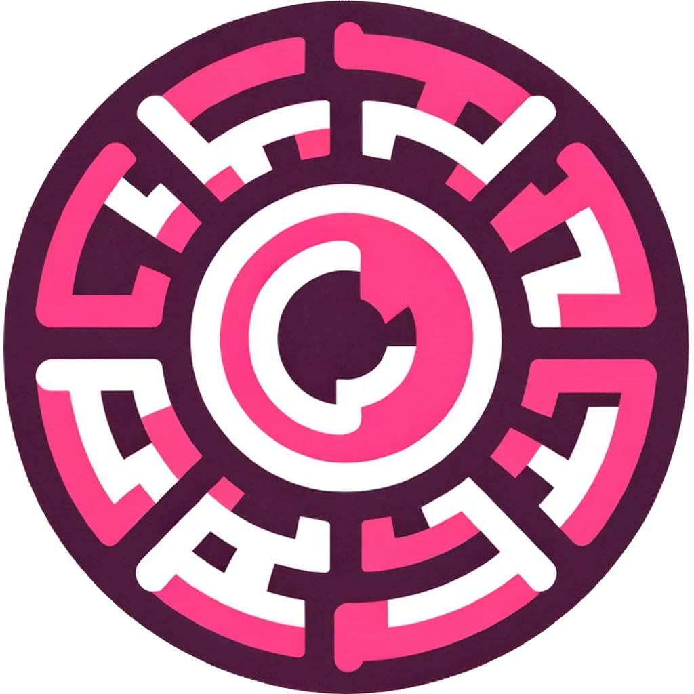

[![Contributors][contributors-shield]][contributors-url]
[![Forks][forks-shield]][forks-url]
[![Stargazers][stars-shield]][stars-url]
[![Issues][issues-shield]][issues-url]
[![MIT License][license-shield]][license-url]
[![LinkedIn][linkedin-shield]][linkedin-url]


<!-- PROJECT LOGO -->
<br />
<div align="center">
  <a href="https://github.com/AitorAstorga/RandomNumberGenerator">
    
  </a>

  <h1 align="center">Random Number Generator</h1>

  <p align="center">
    Ionic app that generates configurable random numbers
    <br />
    <a href="https://github.com/AitorAstorga/RandomNumberGenerator"><strong>Explore the docs »</strong></a>
    <br />
    <br />
    <a href="https://github.com/AitorAstorga/RandomNumberGenerator">View Demo</a>
    ·
    <a href="https://github.com/AitorAstorga/RandomNumberGenerator/issues">Report Bug or </a>
    ·
    <a href="https://github.com/AitorAstorga/RandomNumberGenerator/issues">Request Feature</a>
  </p>
</div>

<!-- TABLE OF CONTENTS -->
<details>
  <summary>Table of Contents</summary>
  <ol>
    <li>
      <a href="#about-the-project">About The Project</a>
      <ul>
        <li><a href="#built-with">Built With</a></li>
      </ul>
    </li>
    <li>
      <a href="#getting-started">Getting Started</a>
      <ul>
        <li><a href="#prerequisites">Prerequisites</a></li>
        <li><a href="#installation">Installation</a></li>
      </ul>
    </li>
    <li>
      <a href="#serve">Serve</a>
    </li>
    <li>
      <a href="#build">Build</a>
      <ul>
        <li><a href="#generating-a-release-build">Generating a release build</a></li>
        <li><a href="#running-with-android-studio">Running with Android Studio</a></li>
      </ul>
    </li>
    <li><a href="#contributing">Contributing</a></li>
    <li><a href="#license">License</a></li>
    <li><a href="#contact">Contact</a></li>
    <li><a href="#acknowledgments">Acknowledgments</a></li>
  </ol>
</details>


<!-- ABOUT THE PROJECT -->
## About The Project

This project is about creating a simple yet powerful random number generator using the Ionic framework. It's designed to be user-friendly and highly customizable, allowing users to specify the range and criteria for number generation.

<details>
  <summary>Screenshot</summary>
  
</details>

<p align="right">(<a href="#readme-top">back to top</a>)</p>


### Built With

This project is built with the following technologies:

* 
* 
* 
* 
* 

<p align="right">(<a href="#readme-top">back to top</a>)</p>


<!-- GETTING STARTED -->
## Getting Started

To get a local copy up and running follow these simple example steps.

### Prerequisites

Update npm (or install it otherwise)
```sh
sudo npm install npm@latest -g
```

Install the Ionic Framework
```sh
sudo npm i -g @ionic/cli
```

You will need Android Studio if you want to build the apk.

### Installation

1. Clone the repo
   ```sh
   git clone https://github.com/AitorAstorga/RandomNumberGenerator.git
   ```

2. Install NPM packages
   ```sh
   npm install
   ```

<p align="right">(<a href="#readme-top">back to top</a>)</p>


## Serve

You can create a live server in a web browser with Ionic. Use the command:
```sh
ionic serve
```

You will be prompted to install `@angular/cli`. Install it.
```sh
> ng run app:serve --host=localhost --port=8100

[INFO] Looks like @angular/cli isn't installed in this project.
       
       This package is required for this command to work properly. The package provides a CLI utility, but the ng binary
       was not found in your PATH.

? Install @angular/cli? Yes
```

<p align="right">(<a href="#readme-top">back to top</a>)</p>

## Build

This project is built using Ionic 7.1.5 and Capacitor.

Follow the official Ionic documentation:
- https://ionicframework.com/docs/deployment/play-store
- https://capacitorjs.com/docs/next/android

### Generating a release build
Build the web app:
```
ionic build
```

To generate a release build for Android run the following cli command:
```
npx cap copy && npx cap sync
```
This will copy all web assets and sync any plugin changes.

Next, open Android studio:
```
npx cap open android
```

### Running with Android Studio
In Android Studio, first select the device or emulator and then click the run or debug button to run your app. Unless you're debugging Java or Kotlin code, the run button is preferred.


<!-- CONTRIBUTING -->
## Contributing

Contributions are what make the open source community such an amazing place to learn, inspire, and create. Any contributions you make are **greatly appreciated**.

If you have a suggestion that would make this better, please fork the repo and create a pull request. You can also simply open an issue with the tag "enhancement".
Don't forget to give the project a star! Thanks again!

1. Fork the Project
2. Create your Feature Branch (`git checkout -b feature/AmazingFeature`)
3. Commit your Changes (`git commit -m 'Add some AmazingFeature'`)
4. Push to the Branch (`git push origin feature/AmazingFeature`)
5. Open a Pull Request

<p align="right">(<a href="#readme-top">back to top</a>)</p>


<!-- LICENSE -->
## License

Distributed under the GNU General Public License v3.0. See `LICENSE` for more information.

<p align="right">(<a href="#readme-top">back to top</a>)</p>


<!-- CONTACT -->
## Contact

Aitor Astorga Saez de Vicuña - a.astorga.sdv@gmail.com

Project Link: [https://github.com/AitorAstorga/RandomNumberGenerator](https://github.com/AitorAstorga/RandomNumberGenerator)

<p align="right">(<a href="#readme-top">back to top</a>)</p>


<!-- ACKNOWLEDGMENTS -->
## Acknowledgments

Thanks to these nice projects!

* [Ionic Framework](https://ionicframework.com/)
* [Angular](https://angular.io/)
* [Capacitor](https://capacitorjs.com)
* [Img Shields](https://shields.io)
* [markdown-badges](https://github.com/Ileriayo/markdown-badges#table-of-contents)

<p align="right">(<a href="#readme-top">back to top</a>)</p>


<!-- MARKDOWN LINKS & IMAGES -->
<!-- https://www.markdownguide.org/basic-syntax/#reference-style-links -->
[contributors-shield]: https://img.shields.io/github/contributors/AitorAstorga/RandomNumberGenerator.svg?style=for-the-badge
[contributors-url]: https://github.com/AitorAstorga/RandomNumberGenerator/graphs/contributors
[forks-shield]: https://img.shields.io/github/forks/AitorAstorga/RandomNumberGenerator.svg?style=for-the-badge
[forks-url]: https://github.com/AitorAstorga/RandomNumberGenerator/network/members
[stars-shield]: https://img.shields.io/github/stars/AitorAstorga/RandomNumberGenerator.svg?style=for-the-badge
[stars-url]: https://github.com/AitorAstorga/RandomNumberGenerator/stargazers
[issues-shield]: https://img.shields.io/github/issues/AitorAstorga/RandomNumberGenerator.svg?style=for-the-badge
[issues-url]: https://github.com/AitorAstorga/RandomNumberGenerator/issues
[license-shield]: https://img.shields.io/github/license/AitorAstorga/RandomNumberGenerator.svg?style=for-the-badge
[license-url]: https://github.com/AitorAstorga/RandomNumberGenerator/blob/master/LICENSE
[linkedin-shield]: https://img.shields.io/badge/-LinkedIn-black.svg?style=for-the-badge&logo=linkedin&colorB=555
[linkedin-url]: https://linkedin.com/in/aitor-astorga-saez-de-vicuña
[product-screenshot]: images/screenshot.png
